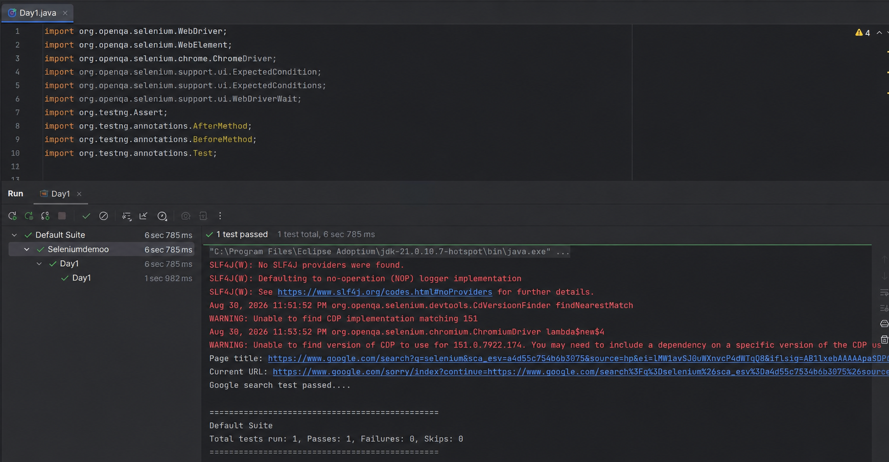

 Google Search Automation

### 🛠️ Technologies
- Java
- Selenium WebDriver
- TestNG
- Maven

### 🧪 Test Scenario
1. Open Google
2. Enter "Selenium WebDriver"
3. Submit search
4. Validate page title
5. Validate Google URL
6. Close browser

### ✅ Result

### Test Execution Screenshot

Test Passed Successfully 🎉
